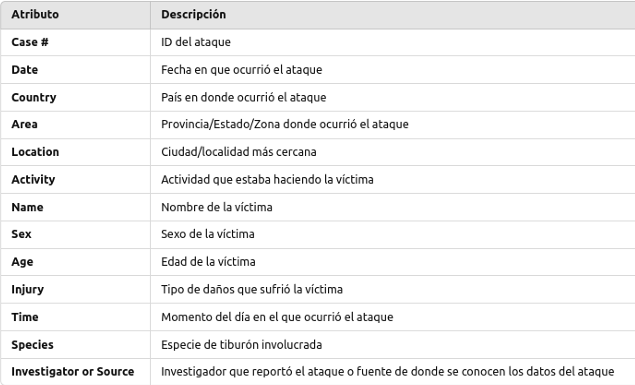
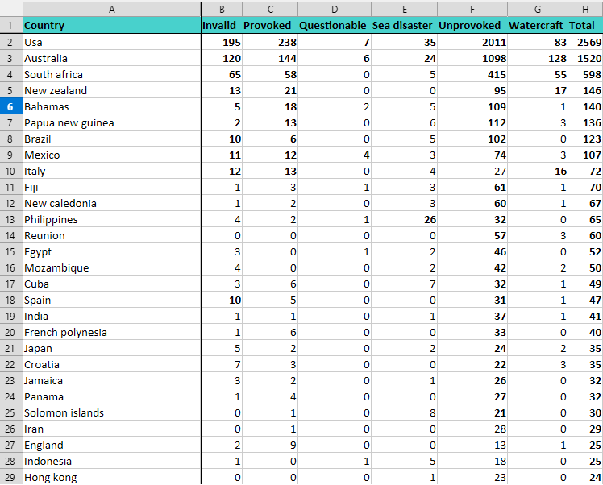
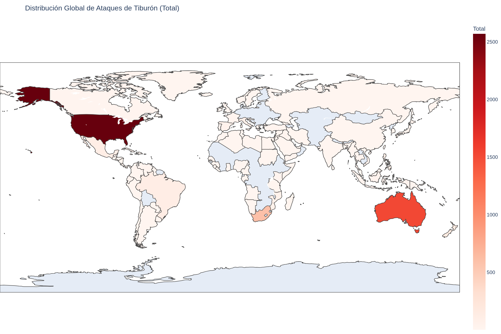

# 3 - Limpieza de Datos

La página Global Shark Attack https://www.sharkattackfile.net/  lleva un control de los
accidentes que se producen por ataques de tiburones en el mundo.

El dataset puede descargarse de: https://www.sharkattackfile.net/incidentlog.htm

Registran los siguientes datos:

## Análisis
A partir de la información provista por la página de referencia, se analiza la cantidad de incidentes de cada tipo por país.
Para ver en detalle el paso a paso del análisis, y observar los distintos criterios adoptados, ver: [**-> Notebook**](notebook.ipynb)

## Resultados
En la siguiente tabla se puede observar para cada país (ordenado por cantidad de incidentes en forma descendente) la cantidad encontrada por tipo de ataque.

También se proveen como resultado del análisis:
- Archivo Excel: analisis_ataques_tiburones
- Imágen de mapa formato png: mapa_ataques_tiburones
- Imágen de mapa formato svg: mapa_ataques_tiburones
- Archivo original fuente de datos: GSAF5

## Análisis Geográfico de Ataques

El siguiente mapa muestra la distribución global de ataques de tiburón, con cada país coloreado según el número total de ataques registrados. Los países con más ataques aparecen en tonos más oscuros de rojo, lo que permite identificar rápidamente las regiones más afectadas por este fenómeno.

